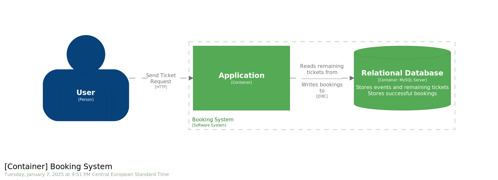

= Ticketing Booking System
:toc:
:icons: font
:source-highlighter: highlight.js

== Overview

This is a ticketing system designed for event bookings. The primary use case is for individuals booking concert tickets for themselves and their friends. The system also includes functionality for event creation, intended for event organizers.

== Features
* Event ticket booking for multiple attendees
* Event creation and management
* Email notification system
* RESTful API interface

== Prerequisites
To use this system, you'll need:

* link:https://www.docker.com/get-started/[Docker]
* link:https://docs.npmjs.com/about-npm[npm] (for API documentation UI)
* link:https://yopmail.com/en/[Yopmail] account (for testing email functionality)

== Installation and Setup

=== Starting the Server
Run the following command from the project root:

[source,bash]
----
docker compose up --build
----

NOTE: You may need to use `sudo` depending on your Docker configuration.

Once the server is running, you can access the API endpoints at `localhost:8090` using Postman or curl.

=== Email Configuration
The system uses a hardcoded SMTP host configuration. For testing purposes, please use a Yopmail email address.

== API Documentation

=== Viewing the Documentation
The API documentation is available in OpenAPI format at `docs/src/openapi/openapi.yml`

=== Setting up the Documentation UI
Navigate to the OpenAPI documentation directory and install dependencies:

[source,bash]
----
cd docs/src/openapi
npm install
----

Start the documentation server (example using port 9090):

[source,bash]
----
npx http-server -p 9090 -c-1 .
----

== Architecture Documentation
The architectural documentation can be found at `docs/build/docs/asciidoc/arch.html`

If the documentation is not present, generate it using:

[source,bash]
----
./gradlew asciidoctor
----

== Testing

=== Running Unit Tests
[source,bash]
----
./gradlew test
----

=== Running Functional Tests
NOTE: Docker is required for functional tests

[source,bash]
----
./gradlew functionalTest
----

== Development Notes
Important technical details:

* The API server runs on port 8090 by default
* Email functionality requires a valid Yopmail address
* All API endpoints are documented in the OpenAPI specification