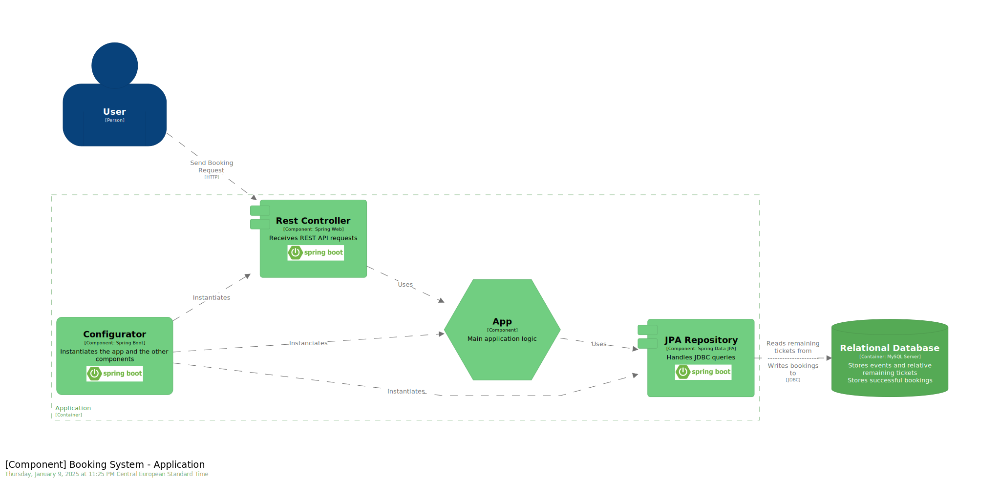

= Traccia 2: Prenotazione biglietti
:customcss: resources/style/style.css
:mermaid-format: svg
:mermaid-theme: dark
:mermaid-background: 393939
:mermaid-width: 960
:mermaid-height: 720

== System Context Diagram

image::./resources/images/system.svg[System,width=640,height=480,opts=inline]

== Container Diagram

image::./resources/images/container.svg[Container,width=960,height=720,opts=inline]

== Component Diagram

== Data Model

[mermaid]
....
include::resources/diagram/model.mmd[]
....
