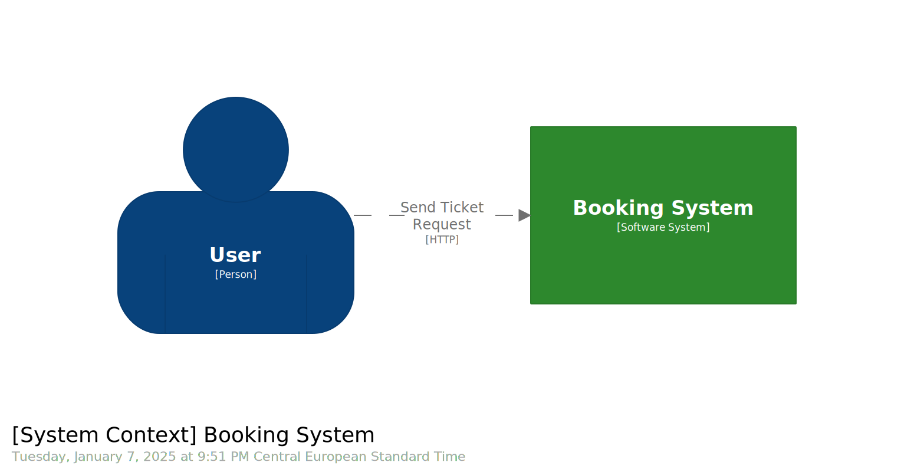

= Traccia 2: Prenotazione biglietti
:customcss: resources/style/style.css
:mermaid-format: svg
:mermaid-theme: dark
:mermaid-background: 393939
:mermaid-width: 960
:mermaid-height: 720

== System Context Diagram

== Container Diagram

image::./resources/images/container.svg[Container,width=960,height=720,opts=inline]

== Component Diagram

image::./resources/images/component.svg[Component,width=1280,height=960,opts=inline]

== Data Model

[mermaid]
....
include::resources/diagram/model.mmd[]
....
