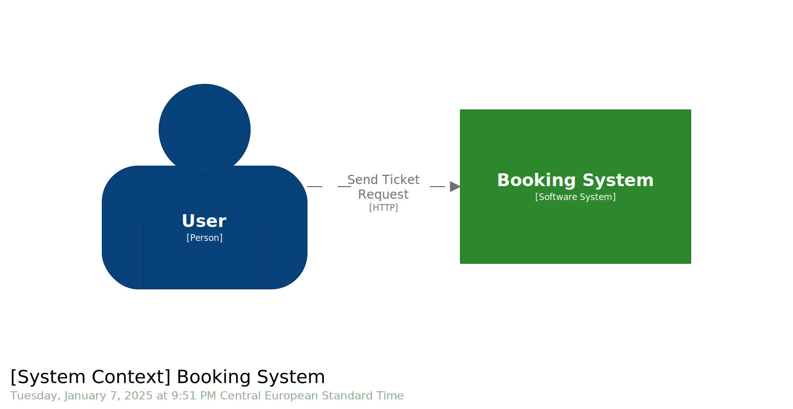

= Traccia 2: Prenotazione biglietti

La prova consiste nel creare un'applicazione web che espone delle API (quindi solo back-end).

Crea un servizio di prenotazione posti per eventi.
I vincoli sono:

* Non si possono prenotare più di 3 biglietti per evento a transazione
* Si possono prenotare più eventi a transazione
* Ogni evento ha un numero limitato di posti
* (Opzionale) Dovrebbe essere possibile ricevere una notifica (email, sms, ecc.) dell'avvenuta transazione (anche simulata)

Non ci interessa il CRUD degli utenti e degli eventi che puoi inserire manualmente a database o nella fonte dati che sceglierai.

== System Context Diagram

== Container Diagram

image::./resources/images/container.svg[Container,width=1280,height=960,opts=inline]